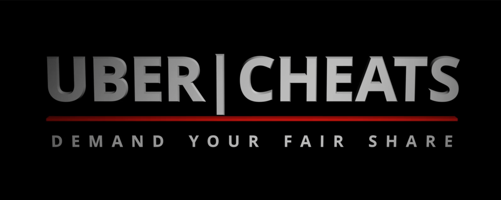

I discovered that UberEATS systematically underpays its drivers regularly.
After 14 emails and 126 minutes on the phone, they finally admitted to this on the record.

This is a Chrome Extension which allows you to detect when UberEATS has underpaid you.

# Videos
1. [Motivation / audio of Uber admitting to underpaying drivers](https://www.youtube.com/watch?v=nNI2kVAyEQ4)
2. [How to use this extension](https://www.youtube.com/watch?v=1k2YYlb21N8)

# TODO
1. Switch between biking/driving directions
